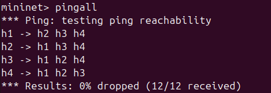
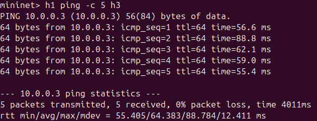
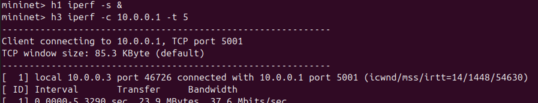
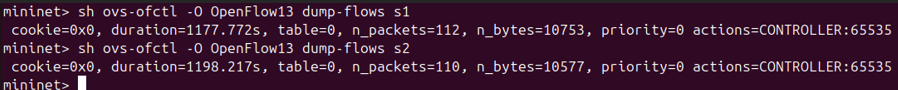
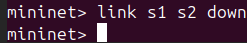
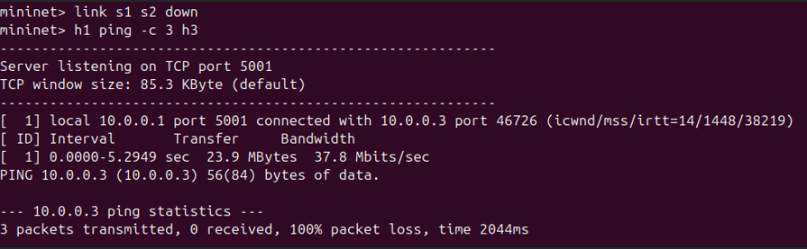
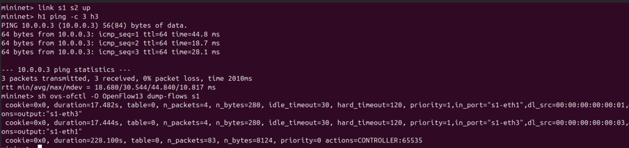
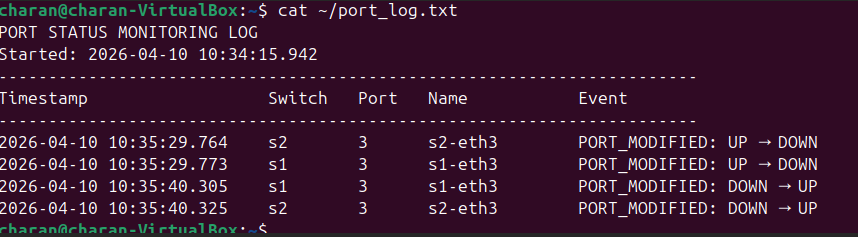

# Port Status Monitoring Tool — SDN Mininet Project

> **SDN Mininet Simulation | Ryu Controller (OpenFlow 1.3)**  
> Monitors switch port state changes in real-time: detects UP/DOWN events, logs changes, generates alerts, and displays a live status table.

---

## Problem Statement

In traditional networks, detecting a port failure requires manual inspection or SNMP polling tools. With SDN, the controller has a **direct, real-time communication channel** with every switch via OpenFlow. This project exploits that to build a **Port Status Monitoring Tool** that:

- Instantly detects when any switch port goes UP or DOWN
- Logs every change to a timestamped file
- Fires terminal alerts with full event details
- Displays a live port status table refreshed every 10 seconds
- Implements MAC learning for intelligent packet forwarding

---

## Topology

```
    h1 (10.0.0.1) ──┐
                    s1 ──────── s2
    h2 (10.0.0.2) ──┘           ├── h3 (10.0.0.3)
                                └── h4 (10.0.0.4)

    Controller: Ryu (localhost:6633)
```

- 2 OVS Switches (OpenFlow 1.3)
- 4 Hosts
- 1 Remote Ryu Controller

---

## Setup & Installation

### Prerequisites

```bash
# Install Mininet
sudo apt-get install mininet

# Install Ryu
pip install ryu #downgrade python to python 3.9 before        installing ryu)

# Install iperf (usually pre-installed)
sudo apt-get install iperf
```

### Clone the Repo

```bash
git clone https://github.com/charanmahesh>/Computer-networks-mininet
cd Computer-networks-mininet
```

---

## How to Run

### Step 1 — Start the Ryu Controller (Terminal 1)

```bash
ryu-manager port_monitor.py --observe-links
```

You should see:
```
============================================================
  PORT STATUS MONITORING TOOL — STARTED
  Controller: Ryu OpenFlow 1.3
  Log File  : port_log.txt
  Status Refresh: every 10s
============================================================
```

### Step 2 — Start Mininet Topology (Terminal 2)

```bash
sudo python3 topology.py
```

---

## Test Scenarios

### Scenario 1 — Normal Operation (All Ports UP)

In Mininet CLI:
```bash
mininet> pingall
mininet> h1 ping -c 5 h3
mininet> iperf h1 h3
```

**Expected Output:**
- All pings succeed
- Controller shows all ports as `[UP]`
- Flow table has active forwarding rules

Verify flow table:
```bash
mininet> sh ovs-ofctl dump-flows s1
mininet> sh ovs-ofctl dump-flows s2
```

---

### Scenario 2 — Port Failure Detection (Port DOWN)

In Mininet CLI:
```bash
mininet> link s1 s2 down
```

**Expected Controller Output:**
```
!!!!!!!!!!!!!!!!!!!!!!!!!!!!!!!!!!!!!!!!!!!!!!!!!!!!!!!!!!!!!
  ⚠  ALERT: PORT DOWN — LINK FAILURE DETECTED
  Timestamp : 2026-04-09 10:32:14.521
  Switch    : s1
  Port No   : 3
  Port Name : s1-eth3
  State     : DOWN
!!!!!!!!!!!!!!!!!!!!!!!!!!!!!!!!!!!!!!!!!!!!!!!!!!!!!!!!!!!!!
```

Then test:
```bash
mininet> h1 ping -c 3 h3    # Should FAIL (no route)
mininet> link s1 s2 up      # Restore link
mininet> h1 ping -c 3 h3    # Should SUCCEED again
```

---

## Expected Output

### Terminal — Live Status Table

```
─────────────────────────────────────────────────────────────────
  LIVE PORT STATUS TABLE
  Updated : 2026-04-09 10:35:22.341   |   Total Changes: 3
─────────────────────────────────────────────────────────────────
  Switch     Port   Name            State    Last Change
─────────────────────────────────────────────────────────────────
  s1         1      s1-eth1         [UP]     2026-04-09 10:30:01.123
  s1         2      s1-eth2         [UP]     2026-04-09 10:30:01.123
  s1         3      s1-eth3         [DOWN]   2026-04-09 10:32:14.521
  s2         1      s2-eth1         [UP]     2026-04-09 10:30:01.456
  s2         2      s2-eth2         [UP]     2026-04-09 10:30:01.456
  s2         3      s2-eth3         [DOWN]   2026-04-09 10:32:14.789
─────────────────────────────────────────────────────────────────
```

### Log File — port_log.txt

```
PORT STATUS MONITORING LOG
Started: 2026-04-09 10:30:00.000
------------------------------------------------------------
Timestamp                 Switch     Port     Port Name       Event
------------------------------------------------------------
2026-04-09 10:32:14.521   s1         3        s1-eth3         PORT_MODIFIED: UP → DOWN
2026-04-09 10:32:14.789   s2         3        s2-eth3         PORT_MODIFIED: UP → DOWN
2026-04-09 10:35:01.112   s1         3        s1-eth3         PORT_MODIFIED: DOWN → UP
2026-04-09 10:35:01.334   s2         3        s2-eth3         PORT_MODIFIED: DOWN → UP
```

---

## Performance Metrics

| Metric | Tool | Command |
|--------|------|---------|
| Latency (RTT) | ping | `h1 ping -c 20 h3` |
| Throughput | iperf | `iperf h1 h3` |
| Flow table entries | ovs-ofctl | `sh ovs-ofctl dump-flows s1` |
| Port statistics | ovs-ofctl | `sh ovs-ofctl dump-ports s1` |
| Packet counts | ovs-ofctl | `sh ovs-ofctl dump-ports-desc s1` |

---

## File Structure

```
port-status-monitor/
├── topology.py       # Mininet topology (2 switches, 4 hosts)
├── port_monitor.py   # Ryu controller (core logic)
├── port_log.txt      # Auto-generated event log
├── screenshots/      # Wireshark captures, terminal output, 
└── README.md         # This file
```

---

## SDN Concepts Demonstrated

| Concept | Where |
|---------|-------|
| Controller–switch interaction | `EventOFPSwitchFeatures`, `EventOFPPortStatus` |
| Flow rule installation | `_install_flow()` with match+action+priority |
| packet_in handling | `packet_in_handler()` — MAC learning |
| Port state monitoring | `port_status_handler()` — UP/DOWN detection |
| OpenFlow message types | PortStatus, FlowMod, PacketOut, PortDescStats |

---

## EXECUTION

## Proof of Execution

### Scenario 1 - Normal Operation
#### Pingall


#### Ping h1 to h3


#### iperf Throughput


#### Flow Table



### Scenario 2 - Port Failure
#### Port Down Alert
,(screenshots/port_down-2.png),

#### Ping Fails


### Scenario 3 - Recovery and Ping Restored
#### All Ports Up



### Log File


## References

1. Ryu SDN Framework Documentation — https://ryu.readthedocs.io
2. OpenFlow 1.3 Specification — https://opennetworking.org/wp-content/uploads/2014/10/openflow-spec-v1.3.0.pdf
3. Mininet Documentation — http://mininet.org/docs/
4. Open vSwitch Documentation — https://docs.openvswitch.org
5. Lantz, B., et al. "A Network in a Laptop: Rapid Prototyping for Software-Defined Networks." HotNets 2010.
